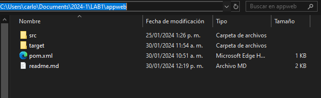

# Laboratorio 1 de AREP - Carlos Alberto Sorza Gómez

## Descripción
Este laboratorio se centra en la implementación de un servidor Web, el cual sirve para consumir una Api de consulta de películas para darnos datos sobre la misma, así mismo una implementación de un caché para ella.

## Pre-requisitos
- JAVA
- Git
- Maven

## Instalación
1. Mediante el comando git clone https://github.com/CarlosSorza/AREP_Lab1.git
2. En la carpeta appweb abrimos una consola

3. Y ejecutamos mvn clean y luego mvn package

## Uso
1. [Explicar cómo ejecutar el laboratorio].
2. [Proporcionar ejemplos y casos de uso].
3. [Instrucciones adicionales para la interacción].

## Contribuciones
Agradecemos contribuciones. Si deseas contribuir, sigue estos pasos:
1. Haz un fork del repositorio.
2. Crea una nueva rama (`git checkout -b feature/nueva-caracteristica`).
3. Realiza cambios y haz commit (`git commit -am 'Añadir nueva característica'`).
4. Haz push a la rama (`git push origin feature/nueva-caracteristica`).
5. Abre una solicitud de extracción.

## Directorios Importantes
- `/src`: Contiene el código fuente del laboratorio.
- `/docs`: Documentación adicional o archivos importantes.

## Notas Adicionales
- [Cualquier información importante que los usuarios deban saber].
- [Consejos o advertencias adicionales].

## Autor
- [Nombre del autor]
- [Correo electrónico]

## Licencia
Este proyecto está bajo la Licencia [tipo de licencia]. Consulta el archivo [LICENSE.md] para obtener más detalles.

## Agradecimientos
- Agradecemos a [menciona a personas o recursos que han contribuido o inspirado el laboratorio].