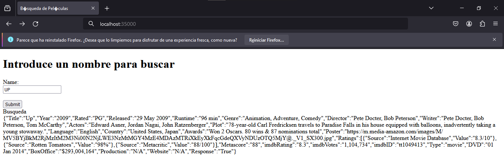
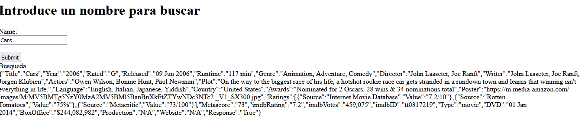
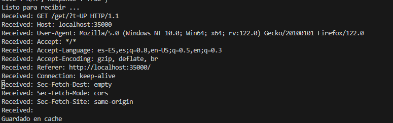

# Laboratorio 1 de AREP - Carlos Alberto Sorza Gómez

## Descripción
Este laboratorio se centra en la implementación de un servidor Web, el cual sirve para consumir una Api de consulta de películas para darnos datos sobre la misma, así mismo una implementación de un caché para ella.

## Pre-requisitos
- JAVA
- Git
- Maven

## Instalación
1. Mediante el comando git clone https://github.com/CarlosSorza/AREP_Lab1.git
2. En la carpeta appweb abrimos una consola

3. Y ejecutamos mvn clean y luego mvn package

## Uso
1. Estando en Firefox en el buscador ponemos http://localhost:350000
    
2. Realizamos la búsqueda colocando el nombre de la película, posteriormente dándole clic al botón submit
    
    
3. Búsqueda de película ya buscada.
    

